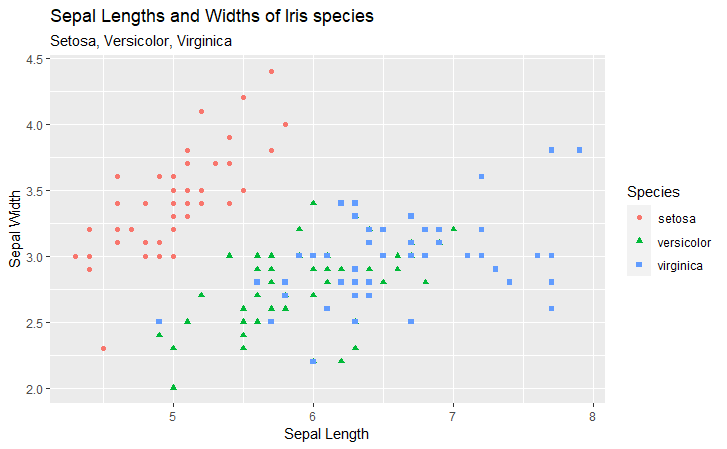

```{r setup, include=FALSE}
knitr::opts_chunk$set(echo = TRUE)
```

## R and R Markdown

Welcome to R! For this tutorial, we'll be using a special output format called **R Markdown**. Markdown lets you combine regular text and code formatting in the same document. You can print to an HTML, PDF, or Word document by changing the `output` parameter up in line 5.

For now, let's go ahead and get started by loading the packages we'll be using today. If this is your first time seeing or using these packages, make sure to run the commented-out lines first.

```{r packages, warning=F, message=F}
# Installing:
# install.packages("ggplot2")
# install.packages("dplyr")
# install.packages("stringr")

library(ggplot2)
library(dplyr)
library(stringr)
```
# R basics
Maybe it's been a while, maybe it's been less than a few hours. Either way, let's review some basics of R and lay out a baseline before we get started with data.
```{r basics}
# R as a calculator:
(1/2 + 3/7)^3 - 4.5555 + (134 %% 17)

# vectors and operations in R:
values = c(1, 2, 3, 4, 5)
mean(values)

# Not all functions will make sense for your data!
words = c("To", "be", "or", "not", "to", "be")
mean(words)

# Use rbind() and cbind() to group vectors into dataframes:
c1 = c(12, 13, 4, 2, 6)
c2 = c(17, 3, 25, 1, 98)
df1 = rbind(c1, c2)
df2 = cbind(c1, c2) 
# Do df1 and df2 look the same? Why or why not?

# Need a lot of the same value?
rep("yes", 10)

# Make sure to save things into variables if you want to use them later!
yes = rep("yes", 10)
yes
```
## Strings in R
While we're here, it's worth going over some common and useful string functions in R. Rarely will you see strings by themselves, but you might encounter these when doing file processing or reading CSVs (more on this later!).

```{r strings}
sentence = "two households, both alike in dignity"

# nchar tells us how long a string is:
nchar(sentence)

# We can find substrings using substr:
# (Remember that R uses 1-based indexing!)
# substr(<str>, beginning, end)
substr(sentence, 1, 14)

# Printing and pasting:
print(sentence) # For one argument
paste(sentence, "in fair Verona where we lay our scene") # For more than one

# The sprintf function lets you use formulaic language:
sprintf("from %s grudge break to %s mutiny", "ancient", "new")
# Make sure to match the number of % in your formula!
# sprintf("where %s blood makes %s hands unclean", "civil") # error

# How about word count?
# Let's assume that words are separated by whitespace.
# strsplit gives us all the individual substrings separated by one whitespace character.
strsplit(sentence, " ")
# We find the word count by applying the length function to the splitted list
sapply(strsplit(sentence, " "), length)
```

### Extra Things to Consider and Try
1) The second argument of the `strsplit` tells the function where to separate the parent string into substrings. How might you try different arguments to get individual characters?

2) Suppose you are given the string `"/home/datafest/project/workshop.Rmd"`. How can you use string indexing and splitting to find the name of this file? The name of its directory?

3) In the `sprintf` formula, `%s` represents a string. What if you wanted to represent a number instead? Hint: what is the shortcut for a float or integer?

# Iris
The first dataset we'll be using for this tutorial is the Iris dataset. Since it is one of R's built-in datasets, there's no loading needed! You can access the dataset by calling `iris`. To avoid making modifications to the original `iris` dataset, we'll first save a copy of it under the variable `iris_demo`.

```{r startup}
iris_demo = iris
# You can uncomment the following line and run it to see the full dataset:
# iris

# But most of the time, it's impractical to do this. 

# To get a sense of the columns and value types, we can use the head() function
# to view the first 6 rows
head(iris_demo)

# You can also view the last 6 rows using the tail() function.
tail(iris_demo)

# You could also use the tail() function to see how many rows/observations you have,
# but sometimes it's a bit tricky to count the number of columns manually!
# Use the dim() function to get a sense of how large your dataset is. 
# The output will be of the form (# rows) (# columns)
dim(iris_demo)

# How many rows and columns are in the iris_demo dataset?

```

## Getting summaries and useful data insight functions
Now that we have a basic sense of the data we're looking at, let's explore a little more.

```{r exploration}
# The colnames() function lets us see a list of all the column names in our dataset.
# While we can always view the column names using head(), tail(), or even just calling the data itself,
# this is a handy function to know.
colnames(iris_demo)

# Access columns in R datasets using the following formula:
# dataset_name$column_name

# For example, you can rename columns individually:
iris_demo$Sepal.Length = "Sepal Length"

# or all at once:
newnames = c("Sepal Length", "Sepal Width", "Petal Length", "Petal Width", "Species") # Use the c() function to create a vector
colnames(iris_demo) = newnames
# Be careful here-- columns are reassigned in the order that they appear in the vector!
colnames(iris_demo)

# Rarely will you need to index a dataframe, but remember that R uses 1-indexing:
iris_demo[1, 1]  # first row, first column
iris_demo[3, ]   # all values of the third row 
                 # (leaving blanks returns all values of the other dimension)
iris_demo[, 3]   # all values of the third column
iris_demo[1:3, 4:5] # for ranges, use the colon :
iris_demo[1:3, 4]   # Note that you'll lose column names in single-dimension outputs!

# Finally, you can use the str() function to learn the data types of each column:
str(iris_demo)
```
In the above output, you will see several useful pieces of information. We can see the dimensions again (`150 obs. of 5 variables` means 150 rows, 5 columns). Then we see each of the column names and the data types associated with each one. The first four columns are `num`, which stands for numeric data. The last column, `Species`, is `Factor w/ 3 levels`. This is R's way of referring to strings. 

Note, however, that there are 3 levels given in `Species`, but the `str()` function only gives two: setosa and versicolor. Where's the third?

Possibly the most useful function you will use in starting your data exploration is the `summary()` function:
```{r summary}
summary(iris_demo)
```
Note that each column has its own summary. With large datasets, it might be overwhelming to read! With numerical columns, R gives a 6-number summary; with factor (string) columns, R gives a list of every level (or label) and the corresponding frequencies of that label in the dataset. What is the name of the third level of `Species`?

### Extra Things to Consider and Try:
1) There are other datasets built into R, which you can learn more about [here](http://www.sthda.com/english/wiki/r-built-in-data-sets). Pick one to look at with your teammates, and see what you can learn about the data!

2) In this example, we made a copy of the original `iris` dataset so that we could change the names of the columns. What might be other reasons for choosing to create a copy of the original data? What might be a reason for choosing to manipulate the original data?

3) Data that is numeric may not always be quantitative! Consider the following examples: zip codes, binary (0/1) indicators, phone numbers, year in school. How might you interpret or alter this kind of data before finding the summary? (Hint: look up the `as.factor` and `as.numeric` functions!)

## Loading and merging data
Now, let's look at an example of data that's *not* built in to R. While R is equipped to read in many different types of external datasets, the most commonly used function is `read.csv()`, for CSV files. Let's see how it works for some data about the fifty states:

```{r loadstates}
# Make sure that the CSVs you want to read are in the same folder/directory as your R files!
states = read.csv("statedata_names.csv") 
states_abbr = read.csv("statedata_abbr.csv")
```
R automatically converts both of these into dataframes. Now that you're familiar with some functions to explore the data, try filling in the tasks in the starter code below!

```{r explore-states}
# What are the dimensions of each dataframe?


# What are the column names in each?


# What are the data types in each column of these dataframes?
```
If you're familiar with postal codes, you might have noticed that one of the columns in `states_abbr` corresponds exactly to one of the columns in `states`! In other words, we could merge these datasets together to get more information about each state. Here's how we do that:

```{r merging}
# The simplest way to merge two datasets is the merge function.
# Note that we specified which column in which dataset we wanted
# to merge on-- in this case, equating the state names with their
# postal code abbreviations.
merged = merge(states, states_abbr, 
               by.x = "state.name",
               by.y = "state.abb")

# Check the dimensions of merged. What do you notice?
dim(merged)
```

### Extra Things to Consider and Try:
1) What happens when your data doesn't have the same number of rows? What about rows or columns with missing values?


2) There are other types of merging out there, which depend on what parts of your data you want to keep. You can read about those types [here](https://www.geeksforgeeks.org/joining-of-dataframes-in-r-programming/). In what situations might you want each different type of merging?

## Filtering with R (dplyr)
Let's revisit the `iris_demo` dataset. Remember that we had three levels in iris species. What if we only want to look at one iris species? We can't just index all the rows that have that one species (technically, we could, but that'd get very inefficient and tedious very quickly).

Often, we want to only look at a subset of our data (whether by necessity or by interest). The `dplyr` package gives options for facilitating data filtering and cleaning. Here's a demonstration of the syntax by filtering only the setosa irises:
```{r filtering}
# The %>% operator applies the filters:
iris_setosa = iris_demo %>% filter(Species == "setosa")
# Check the dimensions or rows of iris_setosa!

# We can also apply multiple filters at once:
iris_restricted = iris_demo %>% 
                    filter(Species == "versicolor" |
                             (6.0 < `Sepal Length`) & (`Sepal Length` < 8.0))
# What conditions did we filter iris_restricted on? How many rows do we end up with?
```


## Plotting with R (ggplot)
`ggplot2` is an R package that many people use for its relatively nice graphics options. The syntax is a bit involved, but here's a simple scatter plot of the Sepal Lengths vs. Sepal Widths:
```{r plotting}
ggplot(data = iris,
       mapping = aes(x = Sepal.Length, y = Sepal.Width))+
  geom_point() 

# You can compare it to the base plotting function in R:
plot(x = iris$Sepal.Length, y = iris$Sepal.Width)

# There are options to give both of these descriptive titles, subtitles, and axis labels. See if you and your group can find and figure those out!
```

### A Bonus Challenge:
I created the following plot using the full iris data, in `ggplot`. Can you and your group reproduce it?




## Functions in R
Like any other programming language, R has several functions that are built in for you, like `summary`, `mean`, `min`, etc. You can also define your own functions to facilitate your code:
```{r function}
# There are several new functions introduced in the definition of this function.
# If you're familiar with the formula for calculating variance,
# see if you can figure out what they do!
variance_function = function(data){
  xbar = mean(data)
  n = length(data)
  sum = 0
  for (x in data){
    sum = sum + (x - xbar)^2
  }
  return(sum / (n - 1))
}

# Try using this function on a vector you've defined, 
# or one of the columns from the iris_demo

# The built-in R function for variance is called var(). 
# How does the output of variance_function compare?
```

# Final Remarks

This was just a quick overview of some of the tools and skills you might need as you go into your Datafest project. One of the best resources you have this weekend are the amazing mentors that will be available in the Data Science Studio! And when in doubt, hit the `??` in front of any keyword in your console. Magic will happen.

Good luck, and have fun at Datafest 2023!